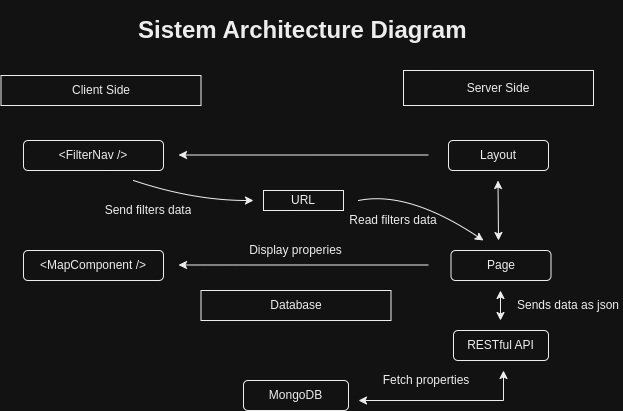

# Real Estate Projects Visualization with Google Map API

## Table of Contents

-   [Description](#description)
-   [Features](#features)
-   [Technologies](#technologies)
-   [Getting Started](#getting-started)
    -   [Prerequisites](#prerequisites)
    -   [Running with Docker](#running-with-docker)
    -   [Tests with Cypress Logs](#tests-with-cypress-logs)
-   [Contributing](#contributing)
-   [Architecture Decision Record](#architecture-decision-record)

## Demo

-   [Project Demo on YouTube](https://www.youtube.com/watch?v=USTM_HdKN2I)

## Description

Propital is a RESTful API that allows clients to explore real estate projects on an interactive map. It provides detailed information about each project, including its name, location, description, and relevant details.

## Features

-   Visualize real estate projects on an interactive map.
-   Get detailed information about each project by clicking on a marker.
-   Search and filter projects by location, property type, price, and more.
-   Interact with the map for navigation and exploration.
-   Data persistence through a MongoDB database.

## Technologies

-   Next.js for building the API.
-   MongoDB for the database.
-   Google Maps API for the interactive map.
-   Cypress for unit testing.

## Getting Started

### Prerequisites

-   Docker installed on your machine

### Running with Docker

1. Clone this repository to your local machine:

    ```
    git clone https://github.com/your-username/your-repo-name.git
    ```

2. Navigate to the project folder:

    ```
    cd your-repo-name
    ```

3. Add your Google API Key in the docker-compose.yaml file

    ```
    GOOGLE_MAPS_API_KEY="GOOGLE-API-KEY-HERE"
    or
    Directly in the Map Component to avoid Developer Only watermarks
    ```

4. Build and run Docker containers:

    ```
    docker-compose up -d
    ```

5. The application will be running at `http://localhost:3000`

### Tests with Cypress Logs

To see the tests of the application run the following command:

```
docker logs <cypress-container-id>
```

## Contributing

We welcome contributions from the community. If you find a bug or have an enhancement in mind, please open an issue or submit a pull request.

# Architecture Decision Record

## Context

The client wants to develop a system for visualizing real estate projects on an interactive map. The main requirements include displaying projects on the map as markers, providing detailed information about each project on click, enabling users to search and filter projects, and persisting data through an API and database.

## Decision 1: Frontend Framework and Technologies

**Status:** Implemented  
**Context:** To build an interactive web application, we chose to use Next.js as the frontend framework. Next.js provides server-side rendering, easy API integration, and a great development experience. Additionally, we decided to use Google Maps API for displaying the interactive map with markers. We also utilized React components, such as Slider and InfoWindow, to enhance the user experience.  
**Decision:** Next.js, Google Maps API, React, Slider, InfoWindow.

## Decision 2: Database and Backend Framework

**Status:** Implemented  
**Context:** For the backend, we opted for a RESTful API using Node.js with TypeScript. We implemented an API endpoint that handles POST requests to filter and fetch real estate properties based on user-defined parameters. As for the database, we chose MongoDB due to its flexibility and ease of integration with Node.js. MongoDB allows us to store and query property data efficiently.  
**Decision:** Node.js with TypeScript, MongoDB.

## Decision 3: Data Structure

**Status:** Implemented  
**Context:** To represent the real estate properties and filter options, we defined TypeScript interfaces for properties and filters. These interfaces ensure type safety throughout the application and API. Additionally, we created a data file to provide sample property data for testing and development purposes.  
**Decision:** TypeScript interfaces for Property and Filter data.

## Decision 4: FilterNav Component

**Status:** Implemented  
**Context:** To enable users to filter properties by category, price range, and surface area, we developed the FilterNav component. This component consists of buttons for each category, a price range slider, and a surface area slider. The user's filter selections are communicated to the backend API, and the results are displayed on the map.  
**Decision:** Developed FilterNav component to handle property filtering.

## Decision 5: MapComponent

**Status:** Implemented  
**Context:** To display real estate properties as markers on the map and show detailed information in an InfoWindow on marker click, we implemented the MapComponent. This component utilizes Google Maps API and MarkerClusterer to efficiently display multiple markers. The InfoWindow shows the property details when a marker is clicked.  
**Decision:** Developed MapComponent for displaying properties on the map.

## Decision 6: Styling and Layout

**Status:** Implemented  
**Context:** We designed the layout to include a FilterNav component on the left side and the MapComponent on the right side. We applied custom styling using Tailwind CSS to make the user interface visually appealing and responsive. The layout ensures a user-friendly experience on different screen sizes.  
**Decision:** Tailwind CSS for styling and layout.

## Decision 7: Data Persistence

**Status:** Implemented  
**Context:** To store property data, we set up a MongoDB database named "propitalDb" and created a collection called "properties." The real estate properties are fetched from this collection using the API endpoint when the user applies filters or loads the page. The data is efficiently persisted in the database, allowing for future scalability and data integrity.  
**Decision:** MongoDB for data persistence.

## Decision 8: Testing

**Status:** Implemented  
**Context:** We wrote unit tests for the API endpoint and components using Cypress for end-to-end testing and Jest for unit testing. The tests ensure that the application functions as expected, and any changes or new features will be validated with automated tests in the future.  
**Decision:** Cypress for end-to-end testing, Jest for unit testing.

## Consequences

The chosen architecture and technologies have resulted in a functional and user-friendly real estate project visualization system. The Next.js framework enabled efficient development and server-side rendering, while the Google Maps API provided interactive map features. The decision to use TypeScript and MongoDB improved code quality and data persistence. The FilterNav and MapComponent components enhanced the user experience, allowing users to filter properties and view details on the map.

The clear separation of frontend and backend logic has made the codebase maintainable and scalable. Additionally, the automated tests ensure that the system remains stable and reliable, even with future updates.

## Trade-offs

While Next.js and Google Maps API provided excellent features, there was a slight learning curve for developers less familiar with these technologies. However, the benefits of these tools outweighed the initial learning efforts.

Choosing MongoDB for data persistence over traditional relational databases provided flexibility but required careful schema design to ensure data consistency.

## Diagram



Note: The architecture diagram was not provided in the initial submission. If you have a diagram illustrating the system architecture, please include it

---
